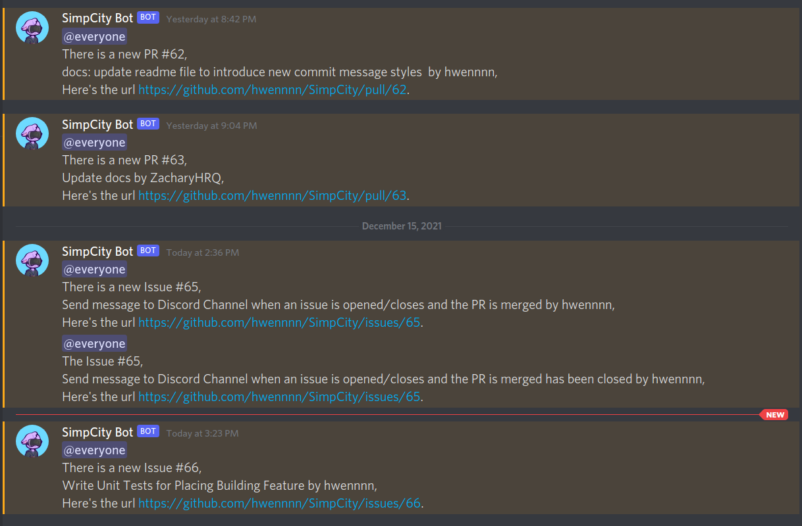

# Github-Discord Webhooks

## Description

A customised self-hosted webhook server to send messages to Discord Channel when there are new activities in Github repository

## Screenshots



## Run locally with Docker

First, update the env variables with your own discord client private and channel id.

```bash
docker-compose up
```

## Deploy the Container to GCP Cloud Run

```bash
gcloud builds submit --tag gcr.io/{YOUR_PROJECT_NAME}/{CONTAINER_NAME}

gcloud beta run deploy --image gcr.io/{YOUR_PROJECT_NAME}/{CONTAINER_NAME} --platform managed --region asia-southeast1 --allow-unauthenticated \
--update-env-vars DISCORD_CLIENT_PRIVATE='YOUR_CLIENT_PRIVATE',DISCORD_CHANNEL_ID='YOUR_CHANNEL_ID'
```
